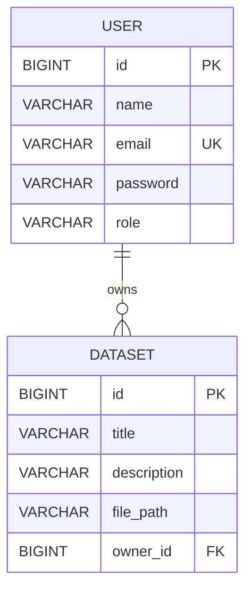

# Entity Relationship (ER) Diagram

## Relationship
- One `USER` can own many `DATASET` records.
- Each `DATASET` belongs to one `USER`.
- `USER.id` is the primary key.
- `DATASET.id` is the primary key.
- `DATASET.owner_id` is a foreign key referencing `USER.id`.
